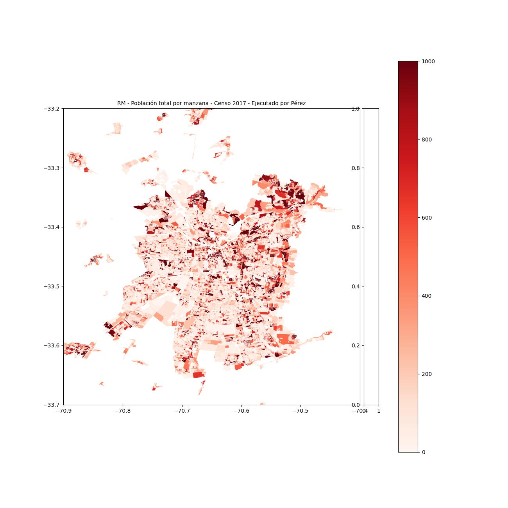
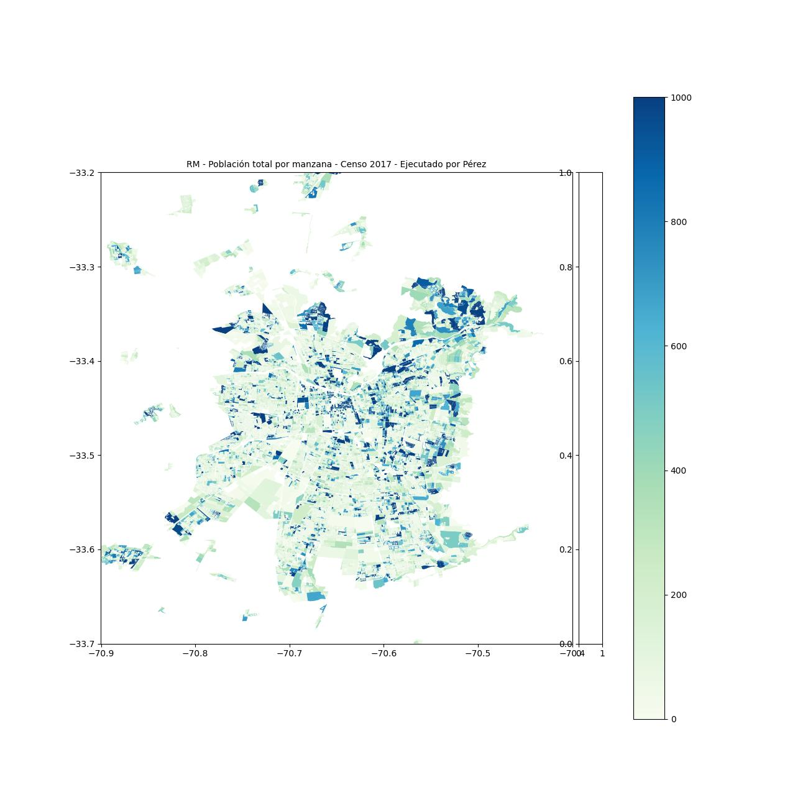

# Actividad 01

## Informacion
El primer cambio que hice fue el de el color del mapa, cambie el colormap ("Reds"), por el colormap GnBu,
colormap que encontre en [matplotlib](https://matplotlib.org/stable/users/explain/colors/colormaps.html#scientific-colour-maps)

## Color Original

## Nuevo Color

